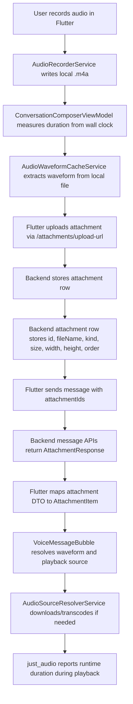

# Audio Message Architecture Review

## Scope

This review covers the current audio-message path across:

- Flutter recording, upload, waveform extraction, playback, and UI rendering
- Rust backend attachment storage and message serialization

## Current Flow

## Backend Contract

- The backend does not persist audio duration.
- The backend does not persist waveform samples.
- The backend does not return audio duration or waveform samples in REST or websocket message payloads.
- The actual attachment response contract is:
  `id`, `url`, `kind`, `size`, `fileName`, `width`, `height`

## Main Architectural Findings

1. There is no durable source of truth for audio metadata.
The only duration available before playback is the client-side timer recorded during capture. Waveform data is also generated client-side and cached locally. After app reinstall, cross-device usage, or cache loss, this metadata is gone because the backend does not store it.

2. "Playable" and "displayable waveform" are coupled too tightly.
`VoiceMessageBubble` currently treats waveform resolution failure as "Audio is not playable," even though playback and waveform extraction are separate concerns. A message can be playable while waveform extraction fails.

3. Audio readiness depends on a multi-stage local pipeline.
For some formats, Flutter must download the remote file, optionally transcode it, then extract waveform data, then initialize playback. Any failure in download, transcode, or waveform extraction can degrade the bubble state even if the raw audio URL is valid.

4. Duration comes from multiple inconsistent sources.
The system currently mixes:
   local wall-clock duration from recording,
   waveform snapshot duration,
   runtime duration reported by `just_audio`.
These sources are not unified under one ownership model.

5. The attachment DTO must stay aligned with the backend contract.
Adding unsupported fields to the Flutter DTO makes the client model look richer than the server contract and obscures where metadata is actually coming from.

## Practical Implications

- Across reloads, persisted behavior depends on local Flutter caches, not backend data.
- Across devices, audio metadata cannot be reconstructed from backend payloads alone.
- A missing waveform should degrade to a playable audio row with reduced visuals, not a hard "not playable" state.

## Recommended Direction

### Short term

- Keep the Flutter attachment DTO aligned with the backend contract.
- Separate playback availability from waveform availability in the bubble UI.
- Continue using runtime duration from `just_audio` as the best available fallback for progress and scrubbing.

### Medium term

- Decide whether audio metadata should be first-class backend data.
- If yes, add `duration_ms` and a compact waveform representation to `attachments`, include them in attachment responses, and make clients treat backend data as canonical.
- If no, explicitly design the Flutter client around ephemeral/local-only waveform metadata and a degraded fallback UI.

## Files Reviewed

- `wetty-chat-flutter/lib/features/chats/conversation/application/conversation_composer_view_model.dart`
- `wetty-chat-flutter/lib/features/chats/conversation/data/audio_waveform_cache_service.dart`
- `wetty-chat-flutter/lib/features/chats/conversation/data/audio_source_resolver_service.dart`
- `wetty-chat-flutter/lib/features/chats/conversation/application/voice_message_playback_controller.dart`
- `wetty-chat-flutter/lib/features/chats/conversation/presentation/message_bubble/voice_message_bubble.dart`
- `wetty-chat-flutter/lib/features/chats/conversation/presentation/message_bubble/message_bubble_content.dart`
- `wetty-chat-flutter/lib/core/api/models/messages_api_models.dart`
- `wetty-chat-flutter/lib/features/chats/models/message_api_mapper.dart`
- `backend/src/models.rs`
- `backend/src/handlers/attachments.rs`
- `backend/src/handlers/chats/mod.rs`
- `backend/src/handlers/ws/messages.rs`
- `backend/src/schema/primary.rs`
- `backend/migrations/*attachments*`
